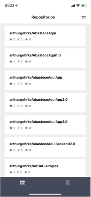

<h1 align="center">GitHuber</h1>

<h2>:electric_plug: Requeriments</h2>

- Yarn >= 1.17.3
- Expo >= 3.1.2
- NPM >= 6.9.0

<h2> Getting started - Mobile </h2>
`cd mobile` 
`npm install` 
`yarn start`

:heavy_exclamation_mark: The backend will start on 19002 port and the Expo client on <b>exp://YourLocalIP:19000</b> or Tunnel.

:newspaper: <a href="https://docs.expo.io/versions/latest/workflow/how-expo-works/">Learn about how expo works here.</a>

